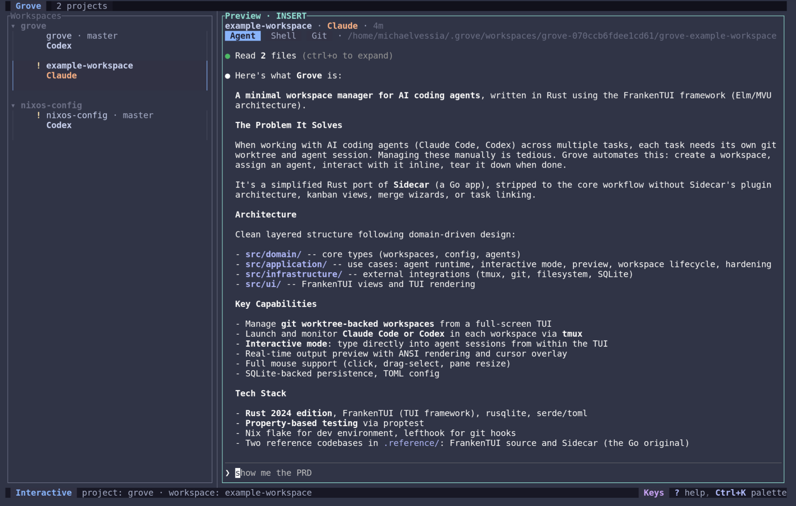

> **Work in progress:** Grove is still cooking, things may change quickly, and I reserve the right to break your workflows :) Thanks for rolling with it.

# Grove

Minimal workspace manager for AI coding agents (Rust + FrankenTUI).

Grove helps you run many agent tasks in parallel, each in its own git worktree
and tmux session, with one fast keyboard-first TUI.



## What Grove Is

Grove is a focused workspace manager for AI coding agents, built with Rust and
FrankenTUI.

It is built for a single job: manage isolated coding workspaces, launch agents,
monitor output live, and clean up safely.

## What Grove Supports

- Git worktree lifecycle, create, edit, merge, update-from-base, delete
- Agent runtime per workspace via tmux sessions (persistent across TUI restarts)
- Supported agents, Claude Code, Codex, and OpenCode
- Interactive mode inside the TUI (send keys directly to running sessions)
- Live output preview with ANSI rendering and cursor-aware display
- Git preview tab via `lazygit`
- Workspace status detection (idle, active, thinking, waiting, done, error)
- Multi-project switching from config
- Mouse support (selection, scroll, pane resize)
- Command palette + keybind help modal
- Event logs and debug record stream for diagnostics

## Scope

- Single-repo workflow per active project
- tmux-only multiplexer support
- No plugin system
- No issue tracker / kanban features
- No PR automation layer

## Requirements

Required binaries on `PATH`:

- `git`
- `tmux`
- `lazygit`

Rust toolchain is required to build from source.

Quick check:

```bash
command -v git tmux lazygit
```

## Install

Most contributors only need one of these:

```bash
# run without installing
nix run github:MichaelVessia/grove

# or run from this repo
direnv allow   # or: nix develop
make tui
```

### Option 1, Nix flake (recommended)

Run directly:

```bash
nix run github:MichaelVessia/grove
```

Install to profile:

```bash
nix profile install github:MichaelVessia/grove
```

Use as an overlay in another flake:

```nix
{
  inputs.grove.url = "github:MichaelVessia/grove";
  # nixpkgs.overlays = [ grove.overlays.default ];
  # then use pkgs.grove
}
```

Use with Home Manager:

```nix
{
  inputs.grove.url = "github:MichaelVessia/grove";

  # In your Home Manager config:
  imports = [ inputs.grove.homeManagerModules.grove ];

  programs.grove = {
    enable = true;
    # Optional: override tool paths
    environment = {
      GROVE_CLAUDE_CMD = lib.getExe pkgs.claude-code;
      GROVE_LAZYGIT_CMD = lib.getExe pkgs.lazygit;
    };
  };
}
```

Available environment overrides: `GROVE_CLAUDE_CMD`, `GROVE_CODEX_CMD`,
`GROVE_OPENCODE_CMD`, `GROVE_LAZYGIT_CMD`.

### Option 2, Devbox

Add Grove to your `devbox.json`:

```bash
devbox add github:MichaelVessia/grove
```

### Option 3, direnv (auto Nix shell)

```bash
direnv allow
cargo build
```

### Option 4, Nix dev shell

```bash
nix develop
cargo build
```

### Option 5, plain Cargo

```bash
cargo build --release
```

Binary path:

```bash
target/release/grove
```

## Quick Start

```bash
# one-time in this clone, if outside nix shell
git config --local core.hooksPath .githooks

# enter dev env (pick one)
direnv allow   # or: nix develop

# fast checks, then launch
make precommit
make tui
```

## Common Commands

```bash
make tui        # launch TUI
make debug-tui  # launch TUI with debug record enabled
make precommit  # cargo fmt --check + cargo check
make ci         # precommit + clippy + tests
make test       # run tests
```

Inside Grove:

- `n` new workspace
- `s` start agent
- `r` restart agent in Agent preview (with confirm modal)
- `Enter` open preview / interactive attach (context dependent)
- `x` stop agent in Agent preview (with confirm modal)
- `Alt+X` stop selected workspace agent from any context (with confirm modal)
- `m` merge workspace branch into base
- `u` update selected workspace (feature merges from base, base pulls from origin)
- `R` refresh workspace list + GitHub PR metadata
- `D` delete workspace
- `p` open project switcher
- `S` settings
- `Ctrl+K` command palette
- `?` keybind help
- `q` quit (with confirm modal)

## CLI Flags

- `--print-hello`, sanity check output path
- `--event-log <path>`, write event log to explicit file (`relative/path` is stored under `.grove/relative/path`)
- `--debug-record`, write continuous debug record to
  `.grove/debug-record-*.jsonl`

Example:

```bash
cargo run -- --debug-record
tail -f .grove/debug-record-*.jsonl
```

## Configuration

Config file paths:

- Linux/macOS (via XDG when available):
  - `~/.config/grove/config.toml`, global settings only
  - `~/.config/grove/projects.toml`, projects + mutable runtime state

One-time migration prompt for existing single-file users:
- [docs/config-migration-prompt.md](docs/config-migration-prompt.md)

Grove behavior:
- Reads `config.toml`, does not write it at runtime
- Reads and writes `projects.toml` for mutable state
- `sidebar_width_pct` and `launch_skip_permissions` are immutable at runtime,
  edit `config.toml` to persist changes

`config.toml` includes:
- `sidebar_width_pct`
- `launch_skip_permissions`

`launch_skip_permissions` behavior:
- Controls default unsafe-mode launch behavior for Claude/Codex/OpenCode
- Workspace-specific `.grove/skip_permissions` marker overrides it
- Agent session inference can override it when marker is absent

`projects.toml` includes:
- `projects` list (`name`, `path`, `defaults`)
- `attention_acks`
- per-project `defaults.agent_env` for agent-specific env vars used at launch

Example `config.toml`:

```toml
sidebar_width_pct = 33
launch_skip_permissions = false
```

Example `projects.toml`:

[[projects]]
name = "grove"
path = "/path/to/repo"

[projects.defaults]
base_branch = "main"
workspace_init_command = "direnv allow"

[projects.defaults.agent_env]
claude = ["CLAUDE_CONFIG_DIR=~/.claude-work"]
codex = ["CODEX_CONFIG_DIR=~/.codex-work"]
opencode = []
```

## Credits

Grove's workflow and UX direction were heavily inspired by
[Sidecar](https://github.com/marcus/sidecar), which was the main reference for
session lifecycle, interaction model, and overall operator experience.

Also built on [FrankenTUI](https://github.com/Dicklesworthstone/frankentui).

## License

MIT, see `LICENSE`.
